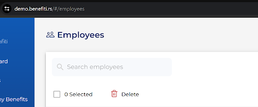

# Improvements

This document contains a series of suggestions for improvement aimed at optimizing the user experience on our site. Each suggestion is carefully formulated to enhance the efficiency and satisfaction of users when interacting with our platform.

## Improvement 1

- **Current**: New users on our site currently do not have access to an interactive guide that would help them become familiar with the site's functionalities.
- **Requested**: Implementation of an onboarding process that includes an interactive introductory tutorial for new users (e.g., Get Started tab in the Sidebar).
- **Reason**: Improving the user experience and facilitating the initial use of the site, leading to greater user satisfaction and retention.

## Improvement 2

- **Current**: When a user creates a new employee and clicks on some fields in the 'Basic info' section, the error "Locations: * Required" appears above the 'Locations' field in the 'Details' section.
- **Requested**: Set the validation messages to appear only when the user clicks on the Save button and mark all required fields with an asterisk.
- **Reason**: This change would avoid confusing users that the 'Locations' field is the only one required and allow a clearer understanding of which fields are really required before attempting to save data. Marking all mandatory fields with an asterisk would further clarify what information is necessary for a successful data save.

## Improvement 3

- **Current**: After users log in as new users (Members) to the site with the rs domain, which is in English, they receive a privacy notice written in Serbian.
- **Requested**: Align the language of the privacy notice with the language of the site so that both are in English or allow users to choose the language of the notice.
- **Reason**: This change would ensure consistency of language settings across the platform, improve the user experience, and allow users to more easily understand the privacy rules that are crucial for safe use of the site.

## Improvement 4

- **Current**: When a user adds an image in the 'Add Local Benefit Group' popup in the Photo section, the description only mentions supported formats without stating that the image must have a landscape orientation with minimum dimensions of 500x500 pixels, resulting in the user receiving an error message if it does not meet these requirements.
- **Requested**: Update the image requirements description in the 'Add Benefit Local Group' section to include the necessity for landscape orientation and minimum size of 500x500 pixels.
- **Reason**: This change would provide users with all the necessary information upfront, reducing confusion and the number of failed attempts due to incorrect image specifications, thus streamlining the process of adding benefits.

## Improvement 5

- **Current**: When a user logs in as an HR on the dashboard, many charts are displayed at once, which can seem overwhelming and make it difficult to quickly find the necessary information.
- **Requested**: Display only the essential, most important graphs on the home screen, while the remaining graphs could be organized into tabs or sections that users can select as needed. Alternatively, these could be minimized and then maximized based on user preference.
- **Reason**: This change would simplify interaction with the dashboard, improving the user experience by enabling faster and more efficient finding of relevant information, while reducing visual clutter and potential information overload.

## Improvement 6

- **Current**: The search input field on the Employee page looks different from the others, resulting in visual inconsistency.
- **Requested**: Unify the design of all search input fields on the platform so that they all have the same visual identity.
- **Reason**: By standardizing the appearance of the search input field, the visual coherence of the platform will be improved, making it easier for users to intuitively navigate and use the search, which contributes to a better user experience.
)

## Improvement 7

- **Current**: When a user adds new employees, they can manually enter a unique ID for each employee.
- **Requested**: Automate the process of creating a unique ID when adding new employees.
- **Reason**: Automating the unique ID creation process would improve efficiency and reduce the possibility of manual input errors. It would also ensure consistency in ID formatting and reduce the need for user intervention, thereby facilitating data management and application maintenance.

## Improvement 8

- **Current**: The "Employees" page and the page where new users are added have the same name, "Employees".
- **Requested**: Change the name of the page that opens when the "Add Employees" button is clicked so that it is called "Add Employees" instead of "Employees".
- **Reason**: Currently, the page for adding new employees has the same name as the page with the list of all employees ("Employees"), which can lead to confusion among users. Changing the name to "Add Employees" will clearly differentiate the two functionalities, thus improving the user experience as users will know immediately that they are on the page to add new employees.

## Improvement 9

- **Current**: After adding an inadequate image in the 'Add Local Benefit Group' popup in the Photo section, the verification message appears “Please upload the image with a landscape orientation (minimum dimensions 500x500px)”.
- **Requested**: Add in the description the maximum image size (e.g., 2 MB maximum).
- **Reason**: Users may not know what technical terms like pixels and landscape orientation mean. Specifying a maximum image size (e.g., 2 MB maximum) instead of a minimum resolution will make it easier for users to understand the concepts.

## Improvement 10

- **Current**: In places in the application where an image can be added, the delete icon is visible immediately, while the visual search icon (which contains other options) appears only when the uploaded image is hovered. This makes the visual search icon less noticeable.
- **Requested**: The visual search icon should be immediately visible next to the image, together with the delete icon, without the need for an additional hover on the image.
- **Reason**: It is easier for users to notice and use functionalities that are immediately visible. The current solution makes it difficult for users to recognize the possibility of visual search (and image editing) because the icon is not immediately visible. This can lead to frustration and decrease the usability of the application. By allowing both icons to be immediately visible, it improves the user experience and increases the efficiency of using the application.
