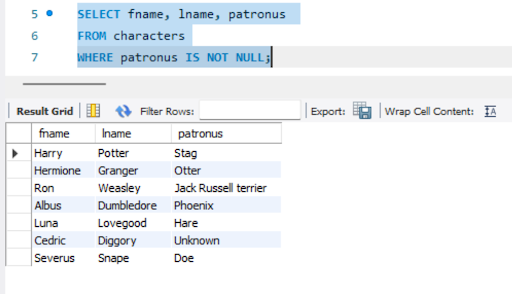

# Select Characters with Known Patronus

**Description:**
This query retrieves the first name, last name, and patronus of characters who have a known patronus (i.e., the patronus is not "Unknown" and is not NULL).

**SQL Query:**

```sql
SELECT fname, lname, patronus
FROM Characters
WHERE NOT patronus = 'Unknown'
  AND patronus IS NOT NULL;
  ```

**Result Example**

| fname   | lname   | patronus               |
|---------|---------|------------------------|
| Harry   | Potter  | Gryffindor             |
| Hermione| Granger | Otter                  |
| Ron     | Weasley | Jack Russell Terrier   |
| ...     | ...     | ...                    |

